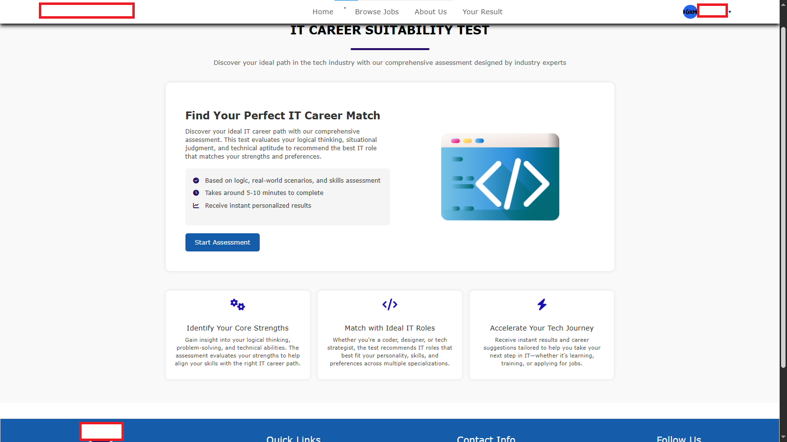
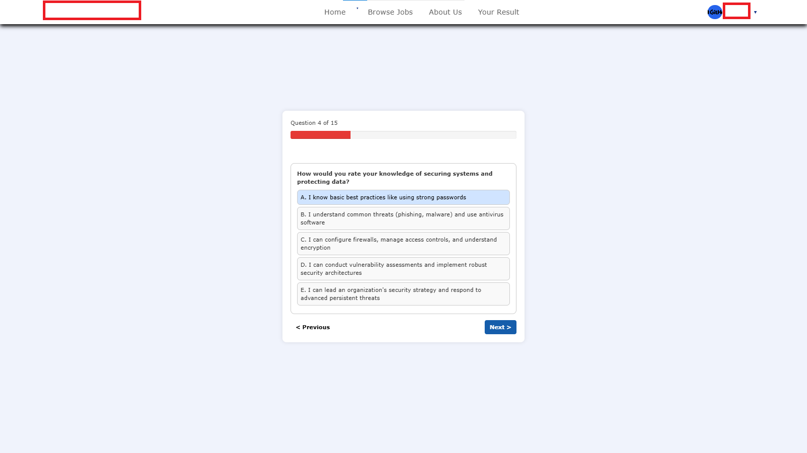
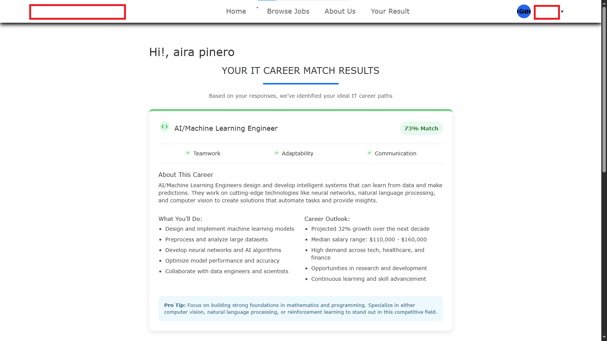
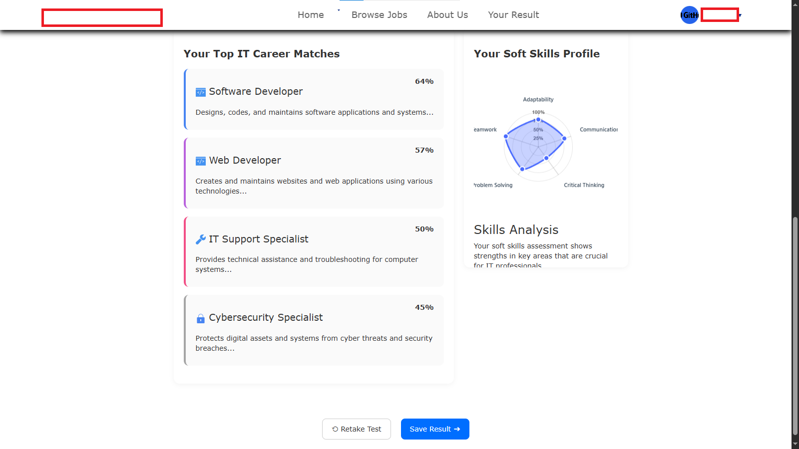
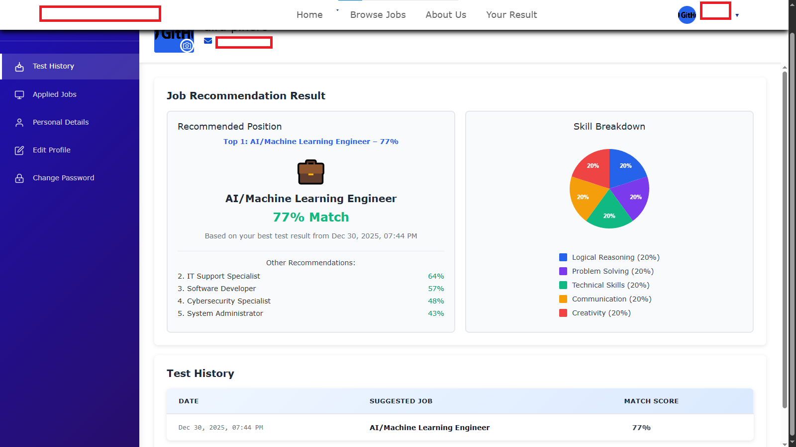
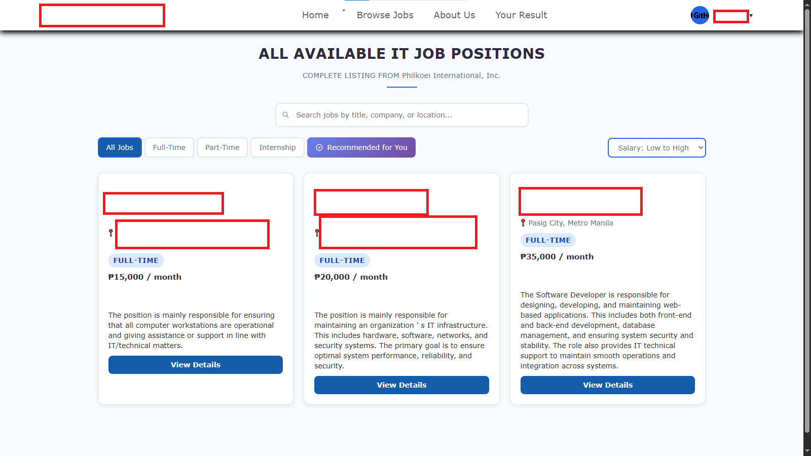
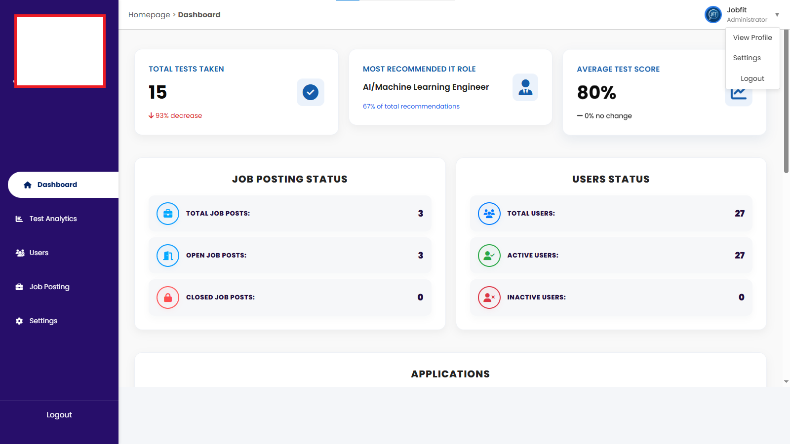
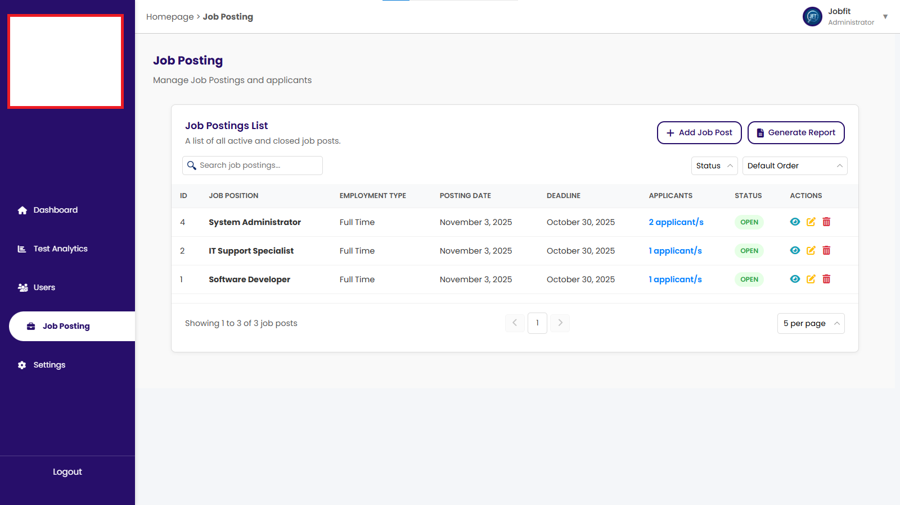

# Job Recommendation and Hiring Platform

##  Overview

Website platform with C4.5 decision tree-based job recommendations through assessments and integrated hiring analytics. Combines AI-powered job matching with comprehensive hiring management.

---

##  Features

- Job applications with resume upload
- C4.5 decision tree assessment for job fit recommendations
- Test histories and detailed technical/soft skills profiles
- Admin job posting and application management
- Email integration for multiple actions
- Customizable templates with system settings and maintenance notifications

---

##  Screenshots

  
  
  
   
  
  
  
   
  
  
  

---

##  Tech Stack

| Component    | Technology         |
| ------------ | ------------------ |
| Backend      | PHP, Python Flask  |
| AI Algorithm | Decision Tree C4.5 |
| Data Source  | Local Dataset      |
| Database     | MySQL              |
| Deployment   | Railway            |

---

> **Note:** This repository intentionally excludes setup instructions and sensitive configuration details due to confidentiality requirements.
